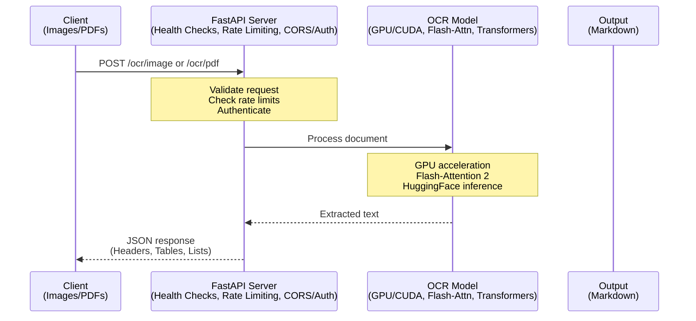

<div align="center">

# DeepSeek-OCR API

**A high-performance FastAPI service for OCR processing using the DeepSeek-OCR model with GPU acceleration**

[](https://www.python.org/downloads/)
[](https://fastapi.tiangolo.com)
[](https://www.docker.com/)
[](https://developer.nvidia.com/cuda-toolkit)
[](https://opensource.org/licenses/MIT)

[Quick Start](#-quick-start) •
[Documentation](#-api-documentation) •
[Examples](#-usage) •
[Contributing](#-contributing)

---

</div>

## Table of Contents

- [Overview](#overview)
- [Features](#features)
- [Requirements](#requirements)
- [Quick Start](#quick-start)
- [Installation](#installation)
- [Configuration](#configuration)
- [Usage](#usage)
- [API Documentation](#api-documentation)
- [Project Structure](#project-structure)
- [Development](#development)
- [Testing](#testing)
- [Troubleshooting](#troubleshooting)
- [Performance Tips](#performance-tips)
- [Contributing](#contributing)
- [License](#license)

---

## Overview

DeepSeek-OCR API is a **production-ready REST API** built with FastAPI that leverages the powerful DeepSeek-OCR model for document processing. It supports image and PDF processing with GPU acceleration, converting documents to structured markdown format.



---

## Features

<table>
<tr>
<td width="50%">

### Performance
- **GPU Acceleration** - Full CUDA support with Flash-Attention 2
- **Async Processing** - Non-blocking I/O for high throughput
- **Optimized Inference** - Efficient memory management

</td>
<td width="50%">

### Document Support
- **Images** - PNG, JPG, WEBP, BMP, TIFF
- **PDFs** - Multi-page with configurable DPI
- **Structured Output** - Clean Markdown format

</td>
</tr>
<tr>
<td width="50%">

### Production Ready
- **Health Monitoring** - Kubernetes-ready probes
- **API Authentication** - Optional API key support
- **Rate Limiting** - Configurable per-IP limits

</td>
<td width="50%">

### Developer Experience
- **Interactive Docs** - Swagger UI & ReDoc
- **Type Safety** - Full Pydantic validation
- **Comprehensive Logging** - Structured JSON logs

</td>
</tr>
</table>

---

## Requirements

### Hardware Requirements

| Component | Minimum | Recommended |
|-----------|---------|-------------|
| GPU | NVIDIA with CUDA support | A100, RTX 3090/4090 |
| VRAM | 8GB | 16GB+ |
| RAM | 16GB | 32GB+ |
| Storage | 20GB | 50GB+ |

### Software Requirements

| Software | Version | Purpose |
|----------|---------|---------|
| NVIDIA Drivers | Latest stable | GPU support |
| CUDA | 11.8+ | GPU acceleration |
| Docker | 20.10+ | Containerization |
| Docker Compose | v2.0+ | Orchestration |
| nvidia-container-toolkit | Latest | GPU in Docker |
| Python | 3.10+ | Local development |

---

## Quick Start

Get up and running in **under 2 minutes**:

```bash
# 1. Clone the repository
git clone https://github.com/yourusername/deepseek-ocr-api.git
cd deepseek-ocr-api

# 2. Copy and configure environment
cp env.example .env

# 3. Start with Docker
docker compose up --build
```

**That's it!** The API is now available at `http://localhost:8000`

### Verify Installation

```bash
# Health check
curl http://localhost:8000/health

# Detailed system info
curl http://localhost:8000/health/detailed
```

### Quick OCR Test

```bash
# Process an image
curl -X POST http://localhost:8000/ocr/image \
  -F "file=@your-document.jpg"
```

---

## Installation

### Docker (Recommended)

Docker provides the easiest and most reliable deployment with all dependencies configured.

<details>
<summary><b>Prerequisites Checklist</b></summary>

1. [Docker Desktop](https://www.docker.com/products/docker-desktop) or Docker Engine installed
2. [nvidia-container-toolkit](https://docs.nvidia.com/datacenter/cloud-native/container-toolkit/install-guide.html) installed
3. GPU access verified:
   ```bash
   docker run --rm --gpus all nvidia/cuda:11.8.0-base-ubuntu22.04 nvidia-smi
   ```

</details>

#### Installation Steps

```bash
# Clone repository
git clone https://github.com/yourusername/deepseek-ocr-api.git
cd deepseek-ocr-api

# Configure environment
cp env.example .env
# Edit .env as needed (optional)

# Build and start
docker compose up --build

# Run in background (detached mode)
docker compose up -d --build
```

### Local Development

For development or when Docker is not available.

<details>
<summary><b>Windows (PowerShell)</b></summary>

```powershell
# Clone repository
git clone https://github.com/yourusername/deepseek-ocr-api.git
cd deepseek-ocr-api

# Copy environment file
Copy-Item env.example .env

# Install dependencies
.\scripts\install-deps.ps1

# Start server
.\scripts\start-server.ps1
```

</details>

<details>
<summary><b>Linux / macOS</b></summary>

```bash
# Clone repository
git clone https://github.com/yourusername/deepseek-ocr-api.git
cd deepseek-ocr-api

# Copy environment file
cp env.example .env

# Create virtual environment
python3 -m venv venv
source venv/bin/activate

# Install dependencies
pip install -e .
# Or for development:
pip install -e ".[dev]"

# Start server
python main.py
```

</details>

---

## Configuration

All configuration is managed through environment variables. Copy `env.example` to `.env` and customize.

### Server Settings

| Variable | Default | Description |
|----------|---------|-------------|
| `HOST` | `0.0.0.0` | Server bind address |
| `PORT` | `8000` | Server port |
| `ENVIRONMENT` | `development` | Environment mode (`development` / `production`) |

### Model Configuration

| Variable | Default | Description |
|----------|---------|-------------|
| `DS_OCR_MODEL` | `unsloth/DeepSeek-OCR` | HuggingFace model identifier |
| `DEVICE` | `auto` | Device for inference (`auto`, `cuda`, `mps`, `cpu`) |
| `BASE_SIZE` | `1024` | Base size for model processing |
| `IMAGE_SIZE` | `640` | Image preprocessing size |

### OCR Settings

| Variable | Default | Description |
|----------|---------|-------------|
| `DEFAULT_PROMPT` | See below | Default OCR prompt |
| `PDF_DPI` | `220` | DPI for PDF conversion |
| `MAX_FILE_SIZE_MB` | `50` | Maximum upload file size |
| `MAX_PDF_PAGES` | `100` | Maximum pages per PDF |

> **Default Prompt:** `<image>\n<|grounding|>Convert the document to markdown format with proper headers, lists, tables, and formatting.`

### Security Settings

| Variable | Default | Description |
|----------|---------|-------------|
| `API_KEY_ENABLED` | `false` | Enable API key authentication |
| `API_KEY` | `""` | API key (required if enabled) |
| `RATE_LIMIT_PER_MINUTE` | `60` | Max requests per minute per IP |
| `CORS_ORIGINS` | `*` | Allowed CORS origins (comma-separated) |
| `PROMPT_MAX_LENGTH` | `2000` | Maximum prompt length |

### Logging

| Variable | Default | Description |
|----------|---------|-------------|
| `LOG_LEVEL` | `INFO` | Log level (`DEBUG`, `INFO`, `WARNING`, `ERROR`, `CRITICAL`) |

---

## Usage

### Image OCR

Process images and extract text as Markdown:

```bash
curl -X POST http://localhost:8000/ocr/image \
  -F "file=@invoice.jpg" \
  -F "prompt=<image>\n<|grounding|>Convert the document to markdown."
```

<details>
<summary><b>Response Example</b></summary>

```json
{
  "success": true,
  "text": "# Invoice\n\n**Invoice Number:** INV-001\n**Date:** 2024-01-15\n\n| Item | Quantity | Price |\n|------|----------|-------|\n| Widget | 10 | $5.00 |",
  "filename": "invoice.jpg",
  "processing_time_seconds": 2.35,
  "model_version": "unsloth/DeepSeek-OCR",
  "correlation_id": "abc123-def456"
}
```

</details>

**Supported Formats:** PNG, JPEG/JPG, WEBP, BMP, TIFF

### PDF OCR

Process multi-page PDF documents:

```bash
curl -X POST http://localhost:8000/ocr/pdf \
  -F "file=@contract.pdf" \
  -F "dpi=220"
```

<details>
<summary><b>Response Example</b></summary>

```json
{
  "success": true,
  "pages": [
    {
      "page_number": 1,
      "text": "# Contract Agreement\n\n**Date:** 2024-01-15...",
      "processing_time_seconds": 2.10,
      "success": true
    },
    {
      "page_number": 2,
      "text": "## Terms and Conditions\n\n1. Payment terms...",
      "processing_time_seconds": 2.05,
      "success": true
    }
  ],
  "total_pages": 2,
  "filename": "contract.pdf",
  "total_processing_time_seconds": 4.15,
  "model_version": "unsloth/DeepSeek-OCR",
  "correlation_id": "xyz789-abc123",
  "warnings": []
}
```

</details>

### Python Examples

<details>
<summary><b>Using requests (sync)</b></summary>

```python
import requests

# Image OCR
with open("document.jpg", "rb") as f:
    response = requests.post(
        "http://localhost:8000/ocr/image",
        files={"file": f},
        data={"prompt": "<image>\n<|grounding|>Convert the document to markdown."}
    )

result = response.json()
print(result["text"])

# PDF OCR
with open("report.pdf", "rb") as f:
    response = requests.post(
        "http://localhost:8000/ocr/pdf",
        files={"file": f},
        data={"dpi": 220}
    )

result = response.json()
for page in result["pages"]:
    print(f"Page {page['page_number']}:\n{page['text']}\n{'-' * 50}")
```

</details>

<details>
<summary><b>Using httpx (async)</b></summary>

```python
import httpx
import asyncio

async def process_document():
    async with httpx.AsyncClient() as client:
        with open("document.jpg", "rb") as f:
            response = await client.post(
                "http://localhost:8000/ocr/image",
                files={"file": ("document.jpg", f, "image/jpeg")},
                data={"prompt": "<image>\n<|grounding|>Convert the document to markdown."}
            )

        return response.json()["text"]

# Run
text = asyncio.run(process_document())
print(text)
```

</details>

### Prompt Reference

| Use Case | Prompt |
|----------|--------|
| **Document → Markdown** | `<image>\n<|grounding|>Convert the document to markdown format with proper headers, lists, tables, and formatting.` |
| **Simple OCR** | `<image>\nFree OCR.` |
| **Figure Parsing** | `<image>\nParse the figure.` |
| **Entity Localization** | `<image>\nLocate <\|ref\|>IBAN<\|/ref\|> in the image.` |
| **Table Extraction** | `<image>\n<\|grounding\|>Extract all tables from this document.` |

---

## API Documentation

### Endpoints Overview

| Method | Endpoint | Description |
|--------|----------|-------------|
| `GET` | `/health` | Basic health check |
| `GET` | `/health/detailed` | Detailed system information |
| `GET` | `/health/ready` | Kubernetes readiness probe |
| `GET` | `/health/live` | Kubernetes liveness probe |
| `POST` | `/ocr/image` | Process image files |
| `POST` | `/ocr/pdf` | Process PDF files |

### Interactive Documentation

With the server running, access:

| Interface | URL | Description |
|-----------|-----|-------------|
| **Swagger UI** | http://localhost:8000/docs | Interactive API explorer |
| **ReDoc** | http://localhost:8000/redoc | Alternative documentation |
| **OpenAPI JSON** | http://localhost:8000/openapi.json | Raw API specification |

---

## Project Structure

```
deepseek-ocr-api/
├── api/                          # FastAPI application
│   ├── app.py                    # FastAPI app factory
│   ├── dependencies.py           # Dependency injection
│   ├── handlers.py               # Exception handlers
│   ├── middleware.py             # CORS and middleware
│   ├── routes.py                 # Route configuration
│   └── routers/                  # API route modules
│       ├── health.py             # Health check endpoints
│       └── ocr.py                # OCR processing endpoints
├── models/                       # Data models
│   ├── schemas.py                # Pydantic request/response models
│   ├── validators.py             # Custom validators
│   └── exceptions.py             # Custom exceptions
├── services/                     # Business logic
│   └── ocr_service.py            # OCR processing service
├── utils/                        # Utility functions
│   └── files.py                  # File handling utilities
├── scripts/                      # Helper scripts
│   ├── install-deps.ps1          # Windows dependency installer
│   ├── start-server.ps1          # Windows server starter
│   └── run-tests.ps1             # Windows test runner
├── tests/                        # Test suite
│   ├── conftest.py               # Pytest configuration
│   ├── test_api.py               # API endpoint tests
│   └── test_ocr_service.py       # Service layer tests
├── config.py                     # Configuration management
├── constants.py                  # Application constants
├── logger.py                     # Logging configuration
├── main.py                       # Application entry point
├── pyproject.toml                # Project metadata & dependencies
├── requirements.txt              # Pip requirements (generated)
├── Dockerfile                    # Docker image definition
├── docker-compose.yml            # Docker Compose configuration
├── env.example                   # Example environment variables
└── README.md                     # This file
```

---

## Development

### Setting Up Development Environment

```bash
# Clone and install with dev dependencies
git clone https://github.com/yourusername/deepseek-ocr-api.git
cd deepseek-ocr-api
pip install -e ".[dev]"

# Optional: Configure pre-commit hooks
pip install pre-commit
pre-commit install

# Run in development mode
python main.py
```

### Code Style Guidelines

- PEP 8 style compliance
- Type hints throughout
- Docstrings for all public functions
- Async/await patterns for I/O operations
- Atomic commits with clear messages

---

## Testing

### Run All Tests

```bash
# Standard run
pytest

# With coverage report
pytest --cov=. --cov-report=html

# Windows PowerShell
.\scripts\run-tests.ps1
```

### Run Specific Tests

```bash
# API tests only
pytest tests/test_api.py

# OCR service tests only
pytest tests/test_ocr_service.py

# Verbose output
pytest -v

# Single test
pytest tests/test_api.py::test_health_check
```

### Test Categories

```bash
# Skip integration tests
pytest -m "not integration"

# Run only integration tests
pytest -m integration
```

---

## Troubleshooting

<details>
<summary><b>GPU Not Detected</b></summary>

**Symptoms:** Model runs on CPU, very slow processing

**Solutions:**

1. Check CUDA installation:
   ```bash
   nvidia-smi
   python -c "import torch; print(torch.cuda.is_available())"
   ```

2. Verify nvidia-container-toolkit (Docker):
   ```bash
   docker run --rm --gpus all nvidia/cuda:11.8.0-base-ubuntu22.04 nvidia-smi
   ```

3. Set `DEVICE=cuda` explicitly in `.env`

</details>

<details>
<summary><b>Out of Memory (OOM)</b></summary>

**Symptoms:** CUDA out of memory errors

**Solutions:**

1. Lower `IMAGE_SIZE` and `BASE_SIZE` in `.env`
2. Reduce `PDF_DPI` for PDF processing
3. Process smaller files
4. Close other GPU-using applications

</details>

<details>
<summary><b>Model Download Issues</b></summary>

**Symptoms:** Model fails to download from HuggingFace

**Solutions:**

1. Check internet connection
2. Set HuggingFace token if required:
   ```bash
   export HF_TOKEN=your_token_here
   ```
3. Manually download:
   ```python
   from transformers import AutoModel
   AutoModel.from_pretrained("unsloth/DeepSeek-OCR")
   ```

</details>

<details>
<summary><b>Port Already in Use</b></summary>

**Symptoms:** `Address already in use` error

**Solutions:**

1. Change port in `.env`:
   ```bash
   PORT=3001
   ```

2. Kill existing process:
   ```bash
   # Linux/Mac
   lsof -ti:8000 | xargs kill -9

   # Windows
   netstat -ano | findstr :8000
   taskkill /PID <PID> /F
   ```

</details>

<details>
<summary><b>Slow Processing</b></summary>

**Symptoms:** OCR takes very long time

**Solutions:**

1. Verify GPU is being used (check logs)
2. Lower `IMAGE_SIZE` in `.env`
3. Use lower DPI for PDFs: `dpi=150`
4. Ensure Flash-Attention is installed
5. Monitor GPU: `nvidia-smi -l 1`

</details>

### Debug Mode

```bash
# Enable detailed logging in .env
LOG_LEVEL=DEBUG

# Or export before running
export LOG_LEVEL=DEBUG
python main.py
```

---

## Performance Tips

### Optimization Checklist

- [ ] **GPU Usage** - Verify CUDA is active in logs
- [ ] **Flash-Attention** - Ensure FA2 is installed for 2-4x speedup
- [ ] **Image Size** - Use appropriate `IMAGE_SIZE` for your documents
- [ ] **PDF DPI** - Use 150-220 DPI (higher isn't always better)
- [ ] **File Size** - Pre-process large files when possible

### Production Deployment Checklist

- [ ] **Security** - Enable `API_KEY_ENABLED` and set `CORS_ORIGINS`
- [ ] **HTTPS** - Use reverse proxy (nginx/traefik) with TLS
- [ ] **Monitoring** - Set up Prometheus/Grafana for metrics
- [ ] **Logging** - Configure persistent logging (ELK, CloudWatch)
- [ ] **Scaling** - Consider job queue (Celery/Redis) for high volume

---

## Contributing

Contributions are welcome! Here's how to get started:

### Quick Contribution Guide

1. **Fork** the repository
2. **Create** a feature branch: `git checkout -b feature/amazing-feature`
3. **Make** your changes with tests
4. **Commit**: `git commit -m 'Add amazing feature'`
5. **Push**: `git push origin feature/amazing-feature`
6. **Open** a Pull Request

### Guidelines

- Follow existing code style
- Add type hints to all functions
- Write docstrings for public APIs
- Include tests for new features
- Keep commits atomic and descriptive

---

## License

This project is licensed under the **MIT License** - see the [LICENSE](LICENSE) file for details.

---

## Acknowledgments

- [DeepSeek AI](https://github.com/deepseek-ai) - OCR model
- [FastAPI](https://fastapi.tiangolo.com/) - Web framework
- [HuggingFace](https://huggingface.co/) - Transformers library
- All contributors and users

---

<div align="center">

## Contact & Support

**Author:** Maximiliano Veiga

---

**If you find this project useful, please consider giving it a star!**

</div>
